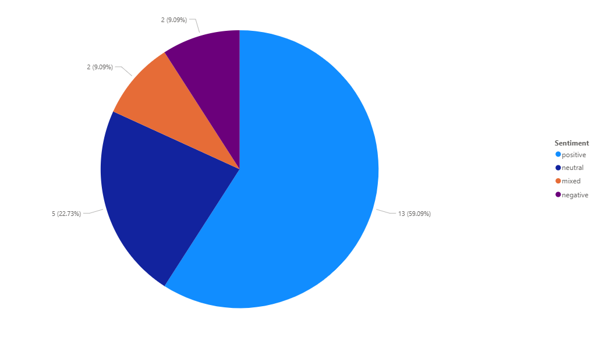

# YT-Comments-Analysis
# perform sentiment analysis and key phrase extraction on YouTube comments using Azure Cognitive Services – Text Analytics API.
---
Tools
-   export comments Website 
-	Azure Cognitive Services – Text Analytics
-	Python (Pandas, Requests, OpenPyXL)
-	Excel / Google Sheets
-	Power BI  for dashboard and visualization

-----

